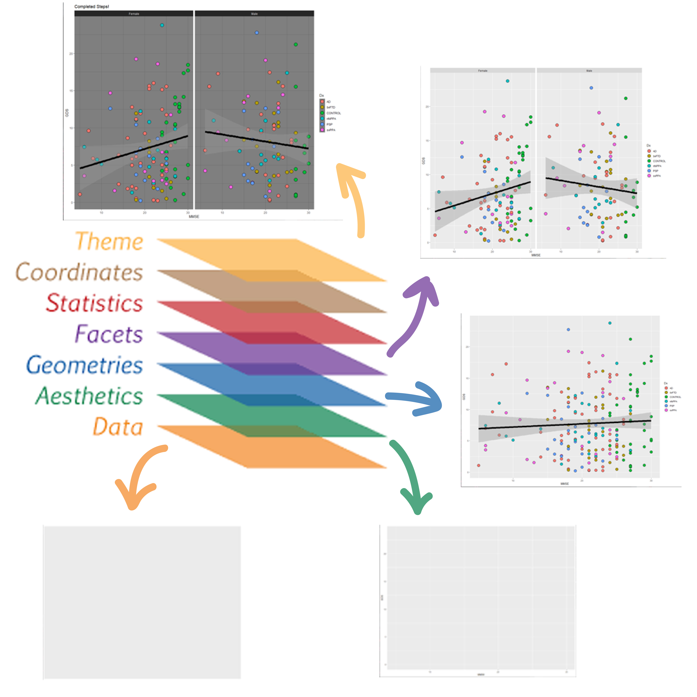
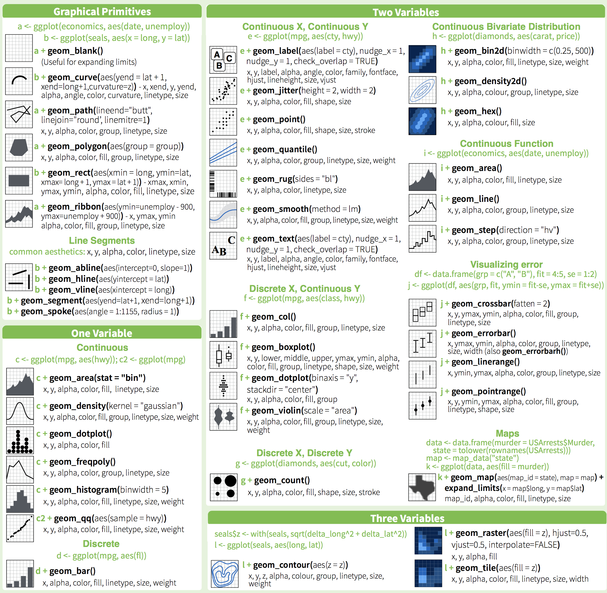
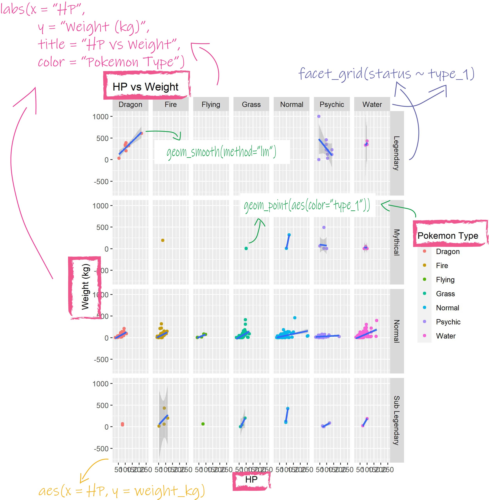

<!-- This file by Winson Yang is licensed under a Creative Commons Attribution 4.0 International License, adapted from the orignal work at https://github.com/rstudio/master-the-tidyverse by RStudio. -->


# Data Visualization with the Pokemon Dataset: Day 1

# R notebooks

This is an [R Markdown](http://rmarkdown.rstudio.com) Notebook. When you execute code within the notebook, the results appear beneath the code.

R code goes in **code chunks**, denoted by three backticks. Executing code chunk by clicking the *Run* button within the chunk or by placing your cursor inside it and pressing *Crtl+Shift+Enter* (Windows) or *Cmd+Shift+Enter* (Mac).

Along the workshop, I will try to share as many best practices as possible. These will be denoted by an fyi box like this:

::: {.fyi}
This is a best practice in R coding (or at least i think it is)
:::

::: {.puzzle}
This is an exercise for you to complete
:::

::: {.note}
This is a is a hint for the exercise
:::

# Setup

The first chunk in an R Notebook is usually titled "setup," and by convention includes the R packages you want to load. Remember, in order to use an R package you have to run some `library()` code every session. Execute these lines of code to load the packages.

To install a package, you have to type `install.packages("packagename")`.

I've actually set the packages up in a way that if the package is not installeed yet `if(!require(packagename))` (`!require()` means package does not exist), it will automatically install it `install.packages("packagename")`, and run load the package `library(packagename)`.

Here is an example:
`if (!require(knitr)) install.packages("knitr"); library(knitr)`.

```{r setup}
if (!require(knitr)){install.packages("knitr")}; library(knitr)
knitr::opts_chunk$set(comment = "#", warning = FALSE, message = FALSE)
```

```{r, load-packages, warning = FALSE, message = FALSE}
if (!require(tidyverse)){install.packages("tidyverse")}; library(tidyverse)
if (!require(skimr)){install.packages("skimr")}; library(skimr)
```

### Load your data

We are going to load the `pokemon.csv` dataset located in the data directory. Let's load the data first.

```{r load-data}
# Set directories 
dirs <- list()
dirs$root <- "../"
dirs$data <- "data"
dirs$output <- "output"

# Set files
csvfile <- "pokemon.csv"

# Load data
filter <- c("Grass", "Fire", "Water", "Psychic", "Normal", "Dragon", "Flying")
df <- read_csv(file.path(dirs$root, dirs$data, csvfile))

# Filter only seven types of pokemon
df <- df %>% filter(type_1 %in% filter)
```

::: {.fyi}
Notice that I separated and comment each part of the process to make it clear for the readers and I to follow. Also, I use `file.path()` to create several subfolders within the project directory (i call it root_dir). This type of naming will make things clear for more complex projects where you have several data sets in several folders, especially for longitudinal studies!

It is good to always create an Rproject for each project you are working on so R will automatically go to the directory where the RProject is located at when you open your project. Some common directories you may find are: data, output, R, plots, and report.
:::

Let's get a rough idea of how our data looks like using R. Use `skim()` to see our data

```{r load-data-exercise}
# Type in your code after this line!
skim(df)

```

# What is ggplot?


GGplot is a powerful data visualization package in R!

Advantages of ggplot2

-   consistent underlying grammar of graphics by Wilkinson (2005)
-   plot specification at a high level of abstraction
-   very flexible
-   theme system for polishing plot appearance
-   mature and complete graphics system
-   many users, active mailing list

## Grammar of ggplot

Understanding the grammar of ggplot2 is fundamental to being able to use it effectively. There are many layers of plotting with ggplot. Ggplot uses independent building blocks and combine them to create just about any kind of graphical display you want. These layers include:

-   data
-   aesthetic mapping
-   geometric object
-   faceting
-   statistical transformations
-   coordinate system
-   themes

{width="450px"}

# Plotting the data

The first thing in ggplot is reference a data to plot. You can do this by using the pipe, or typing it in the code itself. 

`df %>% ggplot()` is the same as `ggplot(data = df)`

::: {.fyi}
Press `CTRL + SHIFT +M` in Windows or `CMD + SHIFT + M` in Mac for the shortcut to %>%.
:::

```{r ggplot-canvas}
df %>% ggplot()


```

##### Now, you try!

::: {.puzzle}
Use `ggplot(data = df)` to see how the plot looks like.
:::

```{r ggplot-canvas-exercise}
# Type your code below this line!
ggplot(data = df)


```

The results are the same!

`ggplot(data = df)` puts the ggplot graphing canvas out and loads the data onto ggplot, so you won't have to reference the variable from the data every time.

So, we've created a blank canvas, but the results is underwhelming because we have not added any shapes or aesthetics to the plot yet.

# Adding aesthetics

In ggplot, aesthetics are something you can see. They include:

-   position (i.e., on the x and y axes)
-   color ("border" color)
-   fill ("inside" color)
-   shape (of points)
-   linetype
-   size


Each type of geom accepts only a subset of all aesthetics-refer to the geom help pages to see what mappings each geom accepts. Aesthetic mappings are set with the `aes()` function.

```{r ggplot-aes}
df %>% ggplot(aes(x = type_1, # Set the X variable
                  y = weight_kg # Set the Y variable
                    ))
```

Notice that now you can see the X and Y axes? We've made some progress! 

##### Now, you try!

::: {.puzzle}
Set the X axis to type_1 and y axis to height_m.
:::

```{r ggplot-aes-exercise}
# Type your code below this line!
df %>% ggplot(aes(x = type_1, # Set the X variable
                  y = height_m # Set the Y variable
                    ))


```

However, did you notice that the data points are missing? It is because these points are geometric objects, or `geoms`. 


# Adding geometrics

Geometric objects are the actual marks we put on a plot. Geoms specify how we want to display the data. Examples include:

-   points (`geom_point`, for scatter plots, dot plots, etc)
-   lines (`geom_line`, for time series, trend lines, etc)
-   boxplot (`geom_boxplot`, for, well, boxplots!)
-   bars (`geom_bar`, for bar plots!)
-   histogram (`geom_histogram`, for histogram)

A plot must have at least one geom; there is no upper limit. You can add a geom to a plot using the + operator

ggplot provides a number of geoms:

```{r eval = FALSE}
geom_abline      geom_density_2d  geom_linerange   geom_rug
geom_area        geom_density2d   geom_map         geom_segment
geom_bar         geom_dotplot     geom_path        geom_sf
geom_bin2d       geom_errorbar    geom_point       geom_sf_label
geom_blank       geom_errorbarh   geom_pointrange  geom_sf_text
geom_boxplot     geom_freqpoly    geom_polygon     geom_smooth
geom_col         geom_hex         geom_qq          geom_spoke
geom_contour     geom_histogram   geom_qq_line     geom_step
geom_count       geom_hline       geom_quantile    geom_text
geom_crossbar    geom_jitter      geom_raster      geom_tile
geom_curve       geom_label       geom_rect        geom_violin
geom_density     geom_line        geom_ribbon      geom_vline
```

Below are examples of the geoms:



More information about ggplot can be found in the [ggplot page](https://ggplot2.tidyverse.org/reference/index.html)

Additional geoms are available in packages like
[`ggbeewsarm`](https://github.com/eclarke/ggbeeswarm) and
[`ggridges`](https://github.com/wilkelab/ggridges)

### Histogram

Here, we are plotting the distribution of the different types of pokemon.

```{r ggplot-geom_histogram}
df %>% ggplot(aes(x = attack # Set the X variable
                  )) +
  geom_histogram()
```

Now we get to see the data points in the plot!


##### Now, you try!

::: {.puzzle}
Set x axis to hp and add geom_histogram.
:::

```{r ggplot-geom_histogram-exercise}
# Type your code below this line!
df %>% ggplot(aes(x = hp # Set the X variable
                  )) +
  geom_histogram()


```


Now, you have just successfully created your first plot using ggplot. Great job!


### Bar plot

We are going to create a few more types of plots to get you familiar

##### Now, you try!

::: {.puzzle}
I want you to try this first. Create a bar plot for x = type_1 and y = weight_kg. Use `geom_bar(position = "dodge", na.rm = TRUE, stat = "identity")` to add it to ggplot.
:::

```{r ggplot-geom_bar}
# Type your code below this line!
df %>% ggplot(aes(x=type_1, y=weight_kg)) +
  geom_bar(position = "dodge", na.rm = TRUE, stat = "identity")

```

::: {.puzzle}
Keep this plot in mind! Now, look at the mean score below. Did you notice anything odd?
:::


```{r ggplot-geom_bar-exercise}
df %>% group_by(type_1) %>% 
  summarize(weight_kg = mean(weight_kg, na.rm = TRUE))

```

Do you notice the difference between the scores on the plot and the mean scores? They are different!

This is one problem with ggplot when you want to plot bar charts. By default, bar charts are plotted as the sum rather than the mean! There are two methods to get the correct mean bar plots:

::: {.fyi}
1. You could summarize the data using `group_by` and `summarize` first before plotting.
2. You could change the argument in `geom_bar` to plot the mean like this: `geom_bar(position = "dodge", stat = "summary", na.rm = TRUE, fun = "mean")`
:::

##### Now, you try!

::: {.puzzle}
Now, use the two methods above to plot the type_1 on the x-axis and height_m on the y-axis.
:::

::: {.note}
Hint: you need to use:

1. `group_by(type_1) %>% summarize(height_m = mean(height_m, na.rm = TRUE))` to create the means for method 1 first before piping it to ggplot for plotting
2. `geom_bar(position = "dodge", stat = "summary", na.rm = TRUE, fun = "mean")` for method 2
:::


```{r ggplot-geom_bar-exercise2}
# Type your code below this line!
df %>% group_by(type_1) %>% summarize(height_m = mean(height_m, na.rm = TRUE)) %>% 
  ggplot(aes(x=type_1, y=height_m)) +
  geom_bar(position = "dodge", na.rm = TRUE, stat = "identity")

df %>% ggplot(aes(x=type_1, y=height_m)) +
  geom_bar(position = "dodge", stat = "summary", na.rm = TRUE, fun = "mean")


```

Now this is the correct bar graph!


### Scatter plot
Scatter plots are excellent way to describe the relationship between two variables. We can plot scatterplots using `geom_point()`. It is very intuitive as points refer to points on the graph, and bar refers to creating bars.


```{r ggplot-geom_point}
df %>% ggplot(aes(x = attack, y = defense)) +
  geom_point()

```

##### Now, you try!

::: {.puzzle}
Plot attack against hp using `geom_point()`.
:::

```{r ggplot-geom_point-exercise}
# Type your code below this line!
df %>% ggplot(aes(x=attack, y=hp)) +
  geom_point()

```


Congratulations, we have created a scatter plot!


# Adding multiple geoms!

We have gone through adding a single geom to our plot. But, did you know that you can also add multiple geoms to your plot? Let's try!

##### Now, you try!

::: {.puzzle}
Let's make it more neat by adding a line using `geom_smooth()` to your attack vs HP plot.
:::

::: {.note}
Hint: We normally want to see a linear trend, so we have to adjust the line to make it linear. We can do this by setting the properties of `geom_smooth()` to `geom_smooth(method = "lm")`.
:::


```{r ggplot-stackgeom-exercise}
# Type your code below this line!
df %>% ggplot(aes(x=attack, y=hp)) +
  geom_point() +
  geom_smooth(method="lm")

```

Note that the order of aesthetics and geometrics affect the layout of your plot!

```{r ggplot-ordermatters}
df %>% ggplot(aes(x = attack, y = defense)) +
  geom_point() +
  geom_smooth(method="lm")

df %>% ggplot(aes(x = attack, y = defense)) +
  geom_smooth(method="lm") +
  geom_point()

```

Whichever layers you type in first will be the inner most layer. Hence, you'll think to think about what you want to present: the line or the points?

::: {.fyi}
**It is good to check the documentation of ggplot and its functions to learn more.** 
:::


::: {.note}
To remove 95% CI, look for `se` in the documentation.
:::


```{r ggplot-geom_smooth-se}
df %>% ggplot(aes(x = attack, y = defense)) +
  geom_point() +
  geom_smooth(method="lm", se=FALSE)
```


# Adding additional properties to your data

Now we only have a basic plot. What if you want to look at where the groups are in the dimensional space? We can add more aesthetics!

## Adding color

We can add color to different categories in the plot inside the aesthetics.

```{r ggplot-color}
df %>% ggplot(aes(x = attack, y = defense)) +
  geom_point(aes(color=type_1)) + # Color only applies to the point
  geom_smooth(method="lm", se=FALSE)
```

If we want the overall of the points to change, set the color outside aesthetics.

```{r ggplot-color2}
df %>% ggplot(aes(x = attack, y = defense)) +
  geom_point(color="red") +
  geom_smooth(method="lm", se=FALSE)

```

##### Now, you try!

::: {.puzzle}
Set the points to colors of different pokemon type (type_1) to your attack vs HP plot.
:::


```{r ggplot-color-exercise}
# Type your code after this line!
df %>% ggplot(aes(x = attack, y = hp)) +
  geom_point(aes(color=type_1)) +
  geom_smooth(method="lm")
  

```


::: {.note}
It is important where you set your aesthetics! `ggplot(aes(x = attack, y = defense, color=type_1))` and `geom_point(aes(color=type_1))` gives you different results!
:::

```{r ggplot-color3}
df %>% ggplot(aes(x = attack, y = defense)) +
  geom_point(aes(color=type_1)) + # Color only applies to the point
  geom_smooth(method="lm", se=FALSE)

df %>% ggplot(aes(x = attack, y = defense, color=type_1)) +
  geom_point() + # Color only applies to the point
  geom_smooth(method="lm", se=FALSE)

```


## Changing the size of the points

Sometimes, we want to adjust the size of the points because of various reasons. Here, the points look a little small to the eyes. We can increase the size using `geom_*point*(size = N)` where N is the size in integer.

```{r ggplot-size}
df %>% ggplot(aes(x = attack, y = hp)) +
  geom_point(aes(color=type_1), size = 3) +
  geom_smooth(method="lm", se=FALSE)

```


##### Now, you try!

::: {.puzzle}
Try to play around with the size of the grouped bar plot.

1.  Add colors to type_1
2.  Change the size of the bars. Instead of `size`, use `width`.
:::

```{r ggplot-size-exercise}
# Type your code after this line!
df %>% group_by(type_1) %>% summarize(height_m = mean(height_m, na.rm = TRUE)) %>% 
  ggplot(aes(x=type_1, y=height_m)) +
  geom_bar(aes(color=type_1), width= 5,
           position = "dodge", na.rm = TRUE, stat = "identity")

```

With bar charts, you have to use `fill` to fill the bars. Remember that colors are for the colors outside the geoms (borders) and fill are for the inside colors.

```{r ggplot-fill}
df %>% group_by(type_1) %>% 
  summarize(weight_kg = mean(weight_kg, na.rm = TRUE)) %>% 
  ggplot(aes(x=type_1, y=weight_kg)) +
  geom_bar(aes(fill=type_1), 
           stat="identity", position="dodge")

df %>% group_by(type_1) %>% 
  summarize(weight_kg = mean(weight_kg, na.rm = TRUE)) %>% 
  ggplot(aes(x=type_1, y=weight_kg)) +
  geom_bar(aes(fill=type_1), 
           color="black",
           stat="identity", position="dodge")


```

When you use size in `geom_bar`, you are changing the size of the border.

```{r ggplot-fill-bar}
df %>% group_by(type_1) %>% 
  summarize(weight_kg = mean(weight_kg, na.rm = TRUE)) %>% 
  ggplot(aes(x=type_1, y=weight_kg)) +
  geom_bar(aes(fill=type_1), 
           color="black", # Color adds border
           stat="identity", position="dodge", size=5)
```


# Faceting your plot

When you want to plot in separate groups, you can use facets. Facetting facilitates comparison among plots, not just of geoms within a plot. `ggplot2` offers two functions for creating smaller graphs:

-   `facet_wrap()`: define subsets as the levels of a single grouping variable
-   `facet_grid()`: define subsets as the crossing of two grouping variables

This is how facet_wrap looks like with 1 and 2 dimensions:

```{r ggplot-facet-wrap}
# Facet wrap with only 1  dimension
df %>% ggplot(aes(x=hp, y=weight_kg)) +
  geom_point(aes(color=type_1)) +
  geom_smooth(method="lm") +
  facet_wrap(.~type_1)

# Facet wrap with 2  dimensions
df %>% ggplot(aes(x=hp, y=weight_kg)) +
  geom_point(aes(color=type_1)) +
  geom_smooth(method="lm") +
  facet_wrap(status~type_1)
```


This is how facet_grid looks like with 1 and 2 dimensions:


```{r ggplot-facet-grid}
# Facet grid with only 1  dimension
df %>% ggplot(aes(x=hp, y=weight_kg)) +
  geom_point(aes(color=type_1)) +
  geom_smooth(method="lm") +
  facet_grid(.~type_1)

# Facet grid with 2  dimensions
df %>% ggplot(aes(x=hp, y=weight_kg)) +
  geom_point(aes(color=type_1)) +
  geom_smooth(method="lm") +
  facet_grid(status~type_1)
```


##### Now, you try!

::: {.puzzle}
Use `facet_wrap()` to facet separate your attack vs hp plot by pokemon status
:::

```{r ggplot-facet-exercise}
# Type your code after this line!
df %>% ggplot(aes(x=attack, y=hp)) +
  geom_point(aes(color=type_1)) +
  geom_smooth(method="lm") +
  facet_wrap(.~status)


```

# Adding labels to your plot!

We can also add or change labels to our plot, such as the x-axis, y-axis, title, and legend. To do this, we use `labs(x= "new x-title", y = "new y title", title = "new title")`


```{r ggplot-labs}
df %>% group_by(type_1) %>% 
  summarize(weight_kg = mean(weight_kg, na.rm = TRUE)) %>% 
  ggplot(aes(x=type_1, y=weight_kg)) +
  geom_bar(aes(fill=type_1), 
           color="black", # Color adds border
           stat="identity", position="dodge") +
  labs(x ="Pokemon Type", 
       y = "Weight (kg)", 
       title= "Weight of pokemon by type",
       fill = "Type")

```

Another neat trick is to have your plot ready as an object, and then add further ggplot components to it.

```{r ggplot-labs2}
gg.bar <- df %>% group_by(type_1) %>% 
  summarize(weight_kg = mean(weight_kg, na.rm = TRUE)) %>% 
  ggplot(aes(x=type_1, y=weight_kg)) +
  geom_bar(aes(fill=type_1), 
           color="black", # Color adds border
           stat="identity", position="dodge")
gg.bar + labs(x="Pokemon Type", 
              y = "Weight (kg)", 
              title= "Weight of pokemon by type",
              fill = "Type")

```

##### Now, you try!

::: {.puzzle}
1.  For your Attack vs hp graph, set the plot as fig2. Remember to add colors for pokemon type!
2.  Add a `labs()` to fig2. Add labels for x, y, title, and color
:::

::: {.note}
Hint: Use `labs(x = "", y = "", title = "", color = "")` to change the labels
:::


```{r ggplot-labs-exercise}
# Type your code after this line!
fig2 <- df %>% ggplot(aes(x=attack, y=hp)) +
  geom_point(aes(color=type_1))
fig2 + labs(x = "Attack", y = "Hit Points", 
            title = "Attack vs Hit Points Plot", 
            color = "Pokemon Type")

```


# Saving your plot!

After you have finished plotting, it is important to save your plot!!

`ggsave()` is a convenient function for saving a plot. It defaults to saving the last plot that you displayed, using the size of the current graphics device. It also guesses the type of graphics device from the extension.

First we have to set our plot as an object before saving.

```{r ggplot-saveplot}
gg.bar2 <- gg.bar + labs(x="Pokemon Type", 
              y = "Weight (kg)", 
              title= "Weight of pokemon by type",
              fill = "Type")
gg.bar2

```

Now that we have set our plot as an object, we can now save it!

```{r ggplot-saveplot-tiff}
ggsave(filename = "type_weight_bar.tiff", plot = gg.bar2, path = "img")

```

You can also save it as a pdf!!

```{r ggplot-saveplot-pdf}
ggsave(filename = "type_weight_bar.pdf", plot = gg.bar2, path = "img")


```

##### Now, you try!

::: {.puzzle}
1. Set your attack vs hp scatterplot as an object called `fig2`. 
2. save the plot as a pdf, jpg, and tiff file.
:::

```{r ggplot-saveplot-exercise}
# Type your code below this line!
fig2 <-  df %>% ggplot(aes(x=attack, y=hp)) +
  geom_point(aes(color=type_1)) + 
  labs(x = "Attack", y = "Hit Points", 
            title = "Attack vs Hit Points Plot", 
            color = "Pokemon Type")

ggsave(filename = "attack_hp.pdf", plot = fig2, path = "img")
ggsave(filename = "attack_hp.jpg", plot = fig2, path = "img")
ggsave(filename = "attack_hp.tiff", plot = fig2, path = "img")

```


# Practice makes perfect!!

Now, it is time to put everything you learn today together! Below is your task:

::: {.puzzle}
1. Create a plot of total_points vs catch_rate
2. Add points color to status
3. Create a linear smooth line
4. Use facet grid to examine this relationship among status
5. Change the labels for title, x, y, and color
:::


::: {.note}
Hint: Use `ggplot(aes())`, `geom_point(aes())`, `geom_smooth()`, `facet_grid()`, and `labs()`.
:::


```{r ggplot-final-exercise}
# Type your code below this line!
df %>% ggplot(aes(x=total_points, y=catch_rate)) +
  geom_point(aes(color=status)) +
  geom_smooth(method="lm", se=FALSE) +
  facet_grid(.~status) +
  labs(x="Total Points", y="Catch Rate",
       title="My plot", color="Legendary Status")


```


# Take aways

For today's workshop, I hope you are able to:
1. Make basic histograms, bar graph, and scatter plots, with ggplot
2. Add aesthetics and facets for multivariate data
3. Change labels for your graph
4. Save your graph

And the most important of all: Reading the documentation in R to understand more about the code or function.

You can use this code template to make thousands of graphs with **ggplot2**.

```{r eval = FALSE}
ggplot(data = <DATA>, aes(<MAPPINGS>)) + 
  <GEOM_FUNCTION>(
     mapping = aes(<ADDITIONAL MAPPINGS>),
     stat = <STAT>, 
     position = <POSITION>
  ) +
  <FACET_FUNCTION> +
  <LABS>
```

## For basic plot


