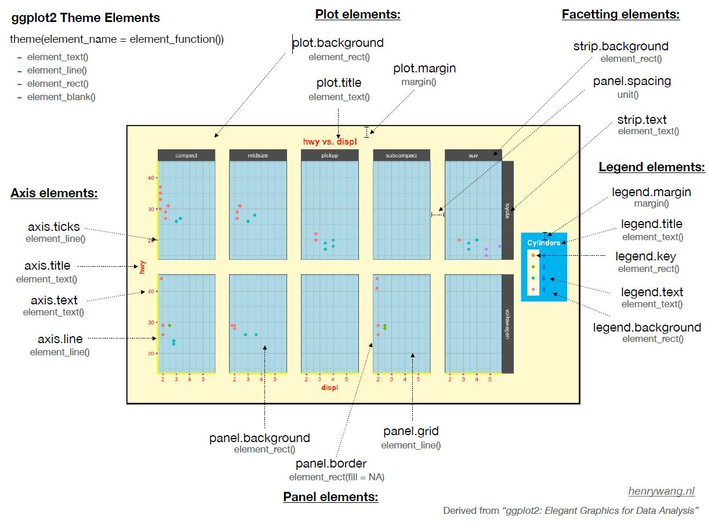

<!-- This file by Winson Yang is licensed under a Creative Commons Attribution 4.0 International License, adapted from the orignal work at https://github.com/rstudio/master-the-tidyverse by RStudio. -->


# Data Visualization with the Pokemon Dataset: Day 2

# R notebooks

This is an [R Markdown](http://rmarkdown.rstudio.com) Notebook. When you execute code within the notebook, the results appear beneath the code.

R code goes in **code chunks**, denoted by three backticks. Executing code chunk by clicking the *Run* button within the chunk or by placing your cursor inside it and pressing *Crtl+Shift+Enter* (Windows) or *Cmd+Shift+Enter* (Mac).

Along the workshop, I will try to share as many best practices as possible. These will be denoted by an fyi box like this:

::: {.fyi}
This is a best practice in R coding (or at least i think it is)
:::

::: {.puzzle}
This is an exercise for you to complete
:::

::: {.note}
This is a is a hint for the exercise
:::

# Setup

The first chunk in an R Notebook is usually titled "setup," and by convention includes the R packages you want to load. Remember, in order to use an R package you have to run some `library()` code every session. Execute these lines of code to load the packages.

To install a package, you have to type `install.packages("packagename")`.

I've actually set the packages up in a way that if the package is not installeed yet `if(!require(packagename))` (`!require()` means package does not exist), it will automatically install it `install.packages("packagename")`, and run load the package `library(packagename)`.

Here is an example:
`if (!require(knitr)) install.packages("knitr"); library(knitr)`.

```{r setup}
if (!require(knitr)){install.packages("knitr")}; library(knitr)
knitr::opts_chunk$set(comment = "#", warning = FALSE, message = FALSE)
```

```{r, load-packages, warning = FALSE, message = FALSE}
if (!require(tidyverse)){install.packages("tidyverse")}; library(tidyverse)
if (!require(skimr)){install.packages("skimr")}; library(skimr)
if (!require(ggrepel)){install.packages("ggrepel")}; library(ggrepel)
if (!require(visNetwork)){install.packages("visNetwork")}; library(visNetwork)
if (!require(ggpubr)){install.packages("ggpubr")}; library(ggpubr)
if (!require(viridis)){install.packages("viridis")}; library(viridis)
if (!require(gghighlight)){install.packages("gghighlight")}; library(gghighlight)
```

### Load your data

We are going to load the `pokemon.csv` dataset located in the data directory. Let's load the data first.

```{r load-data}
# Set directories 
dirs <- list()
dirs$root <- "../"
dirs$data <- "data"
dirs$output <- "output"

# Set files
csvfile <- "pokemon.csv"

# Load data
filter <- c("Grass", "Fire", "Water", "Psychic", "Normal", "Dragon", "Flying")
df <- read_csv(file.path(dirs$root, dirs$data, csvfile))

# Filter only seven types of pokemon
df2 <- df %>% filter(type_1 %in% filter)
```


# Changing colors of your plot!

Changing colors of your plot is always fun, especially if you like UI stuff!! Aesthetically pleasing graphs make reviewers like your results more!

To change the colors of your graph, we first have to look at where was the color implemented:
Was it at `fill` or `color`? This will determine what code we will use to change the colors!

Let's use our Weight bar chart for pokemon type as an example here:


```{r ggplot-labs2}
gg.wtbar <- df %>% group_by(type_1) %>% 
  summarize(weight_kg = mean(weight_kg, na.rm = TRUE)) %>% 
  ggplot(aes(x=type_1, y=weight_kg)) +
  geom_bar(aes(fill=type_1), 
           color="black", # Color adds border
           stat="identity", position="dodge") + 
  labs(x="Pokemon Type", 
              y = "Weight (kg)", 
              title= "Weight of pokemon by type",
              fill = "Type")
gg.wtbar
```

In the bar chart, we used `fill = type_1` for the colors of the bars, hence fill is our target!

Now, to change the colors, we first have to set the colors in an object. Since we have 18 types of pokemon, we need 18 colors.

To add the code in, we can use `scale_fill_manual()`

The `<name>` = "<color>" denotes that for this specific level or factor or name, apply a certain color. If you don't do that, you will just list the colors in order of appearance.

```{r ggplot-theme-colors}
poke_colors <- c(`Normal` = "#A8A77A", `Fire` = "#EE8130", `Water` = "#6390F0",
                `Electric` = "#F7D02C", `Grass` = "#7AC74C", `Ice` = "#96D9D6",
                 `Fighting` = "#C22E28", `Poison` = "#A33EA1", `Ground` = "#E2BF65",
                 `Flying` = "#A98FF3", `Psychic` = "#F95587", `Bug` = "#A6B91A",
                 `Rock` = "#B6A136", `Ghost` = "#735797", `Dragon` = "#6F35FC",
                 `Dark` = "#705746", `Steel` = "#B7B7CE", `Fairy` = "#D685AD")
random_colors <- c("#A8A77A", "#EE8130", "#6390F0", "#F7D02C", "#7AC74C", "#96D9D6",
                   "#C22E28", "#A33EA1", "#E2BF65", "#A98FF3", "#F95587", "#A6B91A",
                   "#B6A136", "#735797", "#6F35FC", "#705746", "#B7B7CE", "#D685AD" )
gg.wtbar + scale_fill_manual(values = poke_colors)
gg.wtbar + scale_fill_manual(values = random_colors)

```

If colors of each group level matters, then you might want to parse a label to the color like I did above in `poke_colors`.

In general, the code for scaling colors is `scale_*_+` where * is the geom you want to modify, for example, fill or color, and + is what the modifier. Here, we are setting the properties manually. Of course you can also try out pre-defined colors:


```{r ggplot-theme-colors2}
gg.wtbar + scale_fill_brewer(palette = "Set2")
```

It is also important to note if you expect people who may be color-blind to read your graphs. Then, you may want to search more color-blind friendly colors! 


##### Now, you try!

::: {.puzzle}
1. Create a Speed bar chart over legendary status:
2. Create labels for x, y, title, and fill
3. Change the colors of your legendary status (`status`) to these four colors: #3B27BA, #E847AE, #13CA91, and #FF9472
4. Name this plot as gg.spdbar
:::


::: {.note}
1. Create an object called `legendcolor` for the colors
2. `group_by(status) %>% summarize(speed=mean(speed))` to create the means
3. `geom_bar(aes(), stat="identity", position="dodge")` to create bar chart
4. `labs(x ="", y="", title="", fill="")` to change labels
5. `scale_fill_manual(values=legendcolor)`
:::


```{r ggplot-colors-exercise}
# Type your code after this line!


```


# Add error bars to your plot

There are several statistics we can add to our plot, but today we are going to focus on error bars. Error bars inform you about the variation in your data. You could add standard deviations or standard errors.

Before adding error bars, we need to create these summary statistics first. We can use `mean()`, `median()`, `sd()` for means, medians, and standard deviation. There is no function for standard error, but you can easily create one using a function like this:

``` {r function-se}
se <- function(x){sd(x)/sqrt(length(x))}
```

To create means and SD, we can pipe our data to `group_by() %>% summarize()` to group the scores by some variable, and summarize the scores for each group.

```{r group-type}
df.atk <- df %>% group_by(type_1) %>% 
  summarize(atk_mean = mean(attack, na.rm = TRUE), 
            atk_median = median(attack, na.rm = TRUE), 
            atk_sd = sd(attack, na.rm = TRUE))
df.atk

```

Now that we have created our summary statistics, we can start plotting!

```{r gg-error-bar}
gg.atk <- df.atk %>% ggplot(aes(x=type_1,y=atk_mean, fill=type_1)) +
  geom_bar(stat="identity", position="dodge") +
  coord_flip() +
  scale_fill_manual(values = poke_colors)

gg.atk + geom_errorbar(aes(ymin=atk_mean-atk_sd, 
                           ymax=atk_mean+atk_sd)) +
  labs(title = "Bar plot with error bars")

```

There are different variants of error bars you can create!

``` {r gg-line-range}
gg.atk + geom_linerange(aes(ymin=atk_mean-atk_sd, 
                           ymax=atk_mean+atk_sd)) +
  labs(title = "Bar plot with line range")

```


``` {r gg-crossbar}
gg.atk + geom_crossbar(aes(ymin=atk_mean-atk_sd, 
                           ymax=atk_mean+atk_sd)) +
  labs(title = "Bar plot with crossbar")

```


``` {r gg-pointrange}
gg.atk + geom_pointrange(aes(ymin=atk_mean-atk_sd, 
                           ymax=atk_mean+atk_sd)) +
  labs(title = "Bar plot with point-range")

```

We can also plot half of the error bars, by specifying `ymin` or `ymax` as the mean.

``` {r gg-error-bars-half-error}
gg.atk + geom_errorbar(aes(ymin=atk_mean, 
                           ymax=atk_mean+atk_sd)) +
  labs(title = "Bar plot with half the error bars")

```

See that the lower range is still visible? This is because of the layering issue ggplot has. We need to plot `geom_errorbar()` before plotting `geom_bar()` so that the bar plot will overlay the error bar.

``` {r error-bar-overlay}
df.atk %>% ggplot(aes(x=type_1,y=atk_mean, fill=type_1)) +
  geom_errorbar(aes(ymin=atk_mean-atk_sd, 
                  ymax=atk_mean+atk_sd)) +
  geom_bar(stat="identity", position="dodge") +
  coord_flip() +
  scale_fill_manual(values = poke_colors) +
  labs(title = "Bar plot with upper error bars")

```

Another way to go about this is to add border to your bars to mask the lower error bars:
``` {r line-range-overlay}
df.atk %>% ggplot(aes(x=type_1,y=atk_mean, fill=type_1)) +
  geom_bar(stat="identity", position="dodge", color="black") +
  geom_errorbar(aes(ymin=atk_mean, 
                    ymax=atk_mean+atk_sd)) +
  coord_flip() +
  scale_fill_manual(values = poke_colors) +
  labs(title = "Bar plot with upper error bars")

```


##### Now, you try!

::: {.puzzle}
1. Create a summary data for speed over legendary status (include mean and sd)
2. Create a speed bar chart over legendary status
3. Add error bars or line range
:::

::: {.note}
Hint: Try `geom_errorbar(width=0)`.
:::


``` {r error-bar-exercise}
# Type your code after this line


```


# Adding text

We can also add text to the plots! Text geoms are useful for labeling plots. They can be used by themselves as scatterplots or in combination with other geoms, for example, for labeling points or for annotating the height of bars. `geom_text()` adds only text to the plot. `geom_label()` draws a rectangle behind the text, making it easier to read.


`geom_text()` and `geom_label()` take in the same aesthetics as any other geoms (x, y, color, fill, etc.). However, for the text to show, you need to supply it with `label=??`. The label argument is where you put the text you want to show.

```{r group-gen}
df %>% group_by(generation) %>% 
  summarize(atk_mean = mean(attack, na.rm = TRUE), 
            atk_median = median(attack, na.rm = TRUE), 
            atk_sd = sd(attack, na.rm = TRUE)) %>% 
  ggplot(aes(x=generation, y=atk_mean, fill=factor(generation))) +
  geom_bar(stat="identity", position="dodge") +
  geom_text(aes(y= atk_mean+5, # Remember to leave some gap because the y-argument is the y-coordinates where the text will be displayed.
                label=round(atk_mean,0))) # Here, we show the mean attack on top of the bar for each generation. 

```


##### Now, you try!

::: {.puzzle}
1. Create a summary data for speed over legendary status (include mean and sd)
2. Create a speed bar chart over legendary status
3. Add error bars or line range
4. Add text above the error bars (`geom_text()` or `geom_label()`)
:::


::: {.note}
Hint: Use `geom_text(aes(y= atk_mean + atk_sd + 5))` to set the y-coordinates of the text above the error bar
:::


``` {r text-exercise}
# Type your code below this line


```


# Editing the theme (becoming the master aRtist!)

Now, we have come to the most artistic part of the workshop: Setting the theme.

ggplot2 supports the notion of themes for adjusting non-data appearance aspects of a plot, such as

* plot titles
* font properties
* axis and legend placement and titles
* background colors
* guide line placement

Theme elements can be customized in several ways:

* theme can be used to adjust individual elements in a plot.
* theme_set adjusts default settings for a session
* pre-defined theme functions allow consistent style changes.

The [full documentation](https://ggplot2.tidyverse.org/reference/theme.html) of the `theme` function lists many customizable elements.

There are some available themes provided by `ggplot2`:

``` {r eval = FALSE}
theme_bw        theme_gray      theme_minimal   theme_void
theme_classic   theme_grey      theme_dark      theme_light
```

Here is how each theme looks like:

```{r ggplot-theme-eg}
gg.basic <- df %>% ggplot(aes(x=attack, y=defense)) + geom_point() # basic scatterplot
gg.bw <- gg.basic + theme_bw() + labs(title= "Theme bw")
gg.gray <- gg.basic + theme_gray() + labs(title= "Theme gray")
gg.minimal <- gg.basic + theme_minimal() + labs(title= "Theme minimal")
gg.void <- gg.basic + theme_void() + labs(title= "Theme void")
gg.classic <- gg.basic + theme_classic() + labs(title= "Theme classic")
gg.grey <- gg.basic + theme_grey() + labs(title= "Theme grey")
gg.dark <- gg.basic + theme_dark() + labs(title= "Theme dark")
gg.light <- gg.basic + theme_light() + labs(title= "Theme light")

ggarrange(gg.bw, gg.gray, gg.minimal, gg.void, gg.classic, gg.grey, gg.dark, gg.light, 
          ncol = 4, nrow=2)

```


```{r ggplot-theme}
gg.wtbar + 
  scale_fill_manual(values = poke_colors) +
  theme_minimal()

```

Things we need to fix and change:
1. Title is meaningless
2. Overlapping X-axis labels (can't see the pokemon type)
3. Legend has no meaning in this plot
4. I don't like grid lines
5. I want to change my fonts


## Fixing axis labels

Item 1 is relatively quick fix since we have gone through them earlier! So, let's do this first!


```{r ggplot-theme-labs}
# Set new object for your plot first.
gg.wtbar2 <- gg.wtbar + scale_fill_manual(values = poke_colors)
gg.wtbar2 + 
  labs(title = "") +
  theme_minimal()

```

## Rotating axis text

For item 2, we can rotate the axis so we can see the pokemon type more clearly. We can do this using `coord_flip()` to flip the axis.


```{r ggplot-theme-coordflip}
gg.wtbar2 +
  labs(title = "") +
  theme_minimal() +
  coord_flip()
```

There are other coordinate system functions such as:

``` {r eval = FALSE}
coord_cartesian  coord_flip       coord_polar      coord_trans
coord_equal      coord_map        coord_quickmap   
coord_fixed      coord_munch      coord_sf  
```


## Removing legend

For item 3, we can remove the legend with `legend.position = "none"` in the theme setting.


```{r ggplot-theme-legend}
gg.wtbar2 +
  labs(title = "") +
  theme_minimal() +
  coord_flip() +
  theme(legend.position = "none")
```

## Removing grid lines

To remove grid lines, there are several options:

``` {r eval = FALSE}
panel.grid.major.x      panel.grid.minor.x 
panel.grid.major.y      panel.grid.minor.y 
```

These options pertain to the major and minor grid lines on the x and y axes. To modify these, you need to set them like this: `panel.grid.major.x = element_line()`. `element_line()` is used to modify line elements like the grids or x/y axes. The properties of `element_line()` can be found in the documentation. To remove the grid, we can simply use `element_blank()` as blank default.


```{r ggplot-theme-gridlines}
gg.wtbar2 +
  labs(title = "") +
  theme_minimal() +
  coord_flip() +
  theme(legend.position = "none",
        # Modify vertical grid lines
        panel.grid.major.x = element_line(size=1),
        panel.grid.minor.x = element_line(linetype = "dashed", size=0.5),
        # Set blank horizontal grid lines
        panel.grid.major.y = element_blank(),
        panel.grid.minor.y = element_blank(),
        )
```


## Changing fonts

Changing fonts can be complicated in ggplot, because there are so many elements where fonts or texts are used! We are going to some today:

``` {r eval = FALSE}
axis.text   axis.text.x     axis.text.y
axis.title  axis.title.x    axis.title.y
```

Simply put, if there is no suffix at the end, the option applies to both x and y axes! We use `element_text()` to edit the properties of texts.

```{r ggplot-theme-text}
gg.wtbar2 +
  labs(title = "") +
  theme_minimal() +
  coord_flip() +
  theme(legend.position = "none",
        # Modify vertical grid lines
        panel.grid.major.x = element_line(size=1),
        panel.grid.minor.x = element_line(linetype = "dashed", size=0.5),
        # Set blank horizontal grid lines
        panel.grid.major.y = element_blank(),
        panel.grid.minor.y = element_blank(),
        # tick labels along axes
        axis.text = element_text(size = 8, family = "mono"),
        # Axis title
        axis.title = element_text(size = 12, face = "bold", family = "mono"),
        )
```


##### Now, you try!

::: {.puzzle}
1. With your Speed bar chart (gg.spdbar), remove the title
2. Remove the legend
3. Modify your grid lines in any way you want
4. Set the font size of x-axis to 22, and y-axis to 18
5. Set overall font family for the axes to mono
:::


::: {.note}
Hint: for overall settings, you can use `axis.text = element_text()` or `axis.title = element_text()`.
:::


```{r ggplot-fonts-exercise}
# Type your code after this line!


```


## Extra resources for themes

There are many resources online for ggplot themes! Here are some of them:

[`ggpubr`](https://rpkgs.datanovia.com/ggpubr/): Useful functions to prepare plots for publication  
[`BBC style`](https://github.com/bbc/bbplot): BBC style theme
[`ggthemes`](https://jrnold.github.io/ggthemes/): Set of extra themes  
[`ggthemr`](https://github.com/cttobin/ggthemr): More themes  
[`ggsci`](https://cran.r-project.org/web/packages/ggsci/vignettes/ggsci.html): Color palettes for scales  
[`paletteer`](https://emilhvitfeldt.github.io/paletteer/): A package of packages of themes


# Tips & Tricks
 
Here are some tips and tricks for you to explore when you plot your data. The list is inexhaustive, but here are some of the common ones most people will use.

## Merging plots together

Sometimes, we have need to plot multiple plots. You might have many associations to explore, or finding some patterns in your data. If that is the case, we can merge these plots together using `ggarrange`. `ggarrange` comes from the `ggpubr` package. There are also other packages out there for you to explore!

For example, these are the plots I wish to create in one single plot:

1. attack vs defense
2. attack vs speed
3. attack vs hp
4. attack vs catch rate

Notice, that one common variable is `attack`? In that case, we can first create a sample plot, then make it into a function so we don't have to copy-paste the code every single time.
``` {r merge-plot-single}
df %>% ggplot(aes(x=attack, y=defense)) +
  geom_smooth(method="lm", se=FALSE) +
  geom_point(aes(color=status), size=2) +
  labs(x="Attack", y="Defense") +
  theme_bw() +
  theme(legend.position = "top") +
  scale_color_manual(values = c(`Normal` = "#DDDDDD", 
                                `Sub Legendary` = "#96CAF7", 
                                `Mythical` = "#FF51EB", 
                                `Legendary` = "#AC27A4"))
```

Now that we have our plot, we need to turn it into a function! Don't worry if you do not know how a function works or how to write one. We have been working with functions all this while actually. What actually goes into the function are arguments which the function will take and use it in a specific place.

Here, we want to modify the `x`, `y`, `x title`, and `y title` as these are the only parts where we want to plot for different combinations. So, we need to modify the plot a little bit to get this out. To create a function, we can parse the `function(){}` into an object like this:

``` {r plot-function}
# we parse our arguments: df, x, y, x_title, y_title
# These are the parts we will tweak with the function when we plot next.

Scatter <- function(df, x, y, x_title, y_title){
  df %>% mutate(status = factor(status, levels = c("Normal", "Sub Legendary", "Mythical", "Legendary"))) %>% 
    ggplot(aes_string(x=x, y=y)) + # we use aes_string for function-based ggplot
  geom_jitter(aes(color=status), size=2) + # Use jitter to plots don't overlay on each other perfectly
  geom_smooth(method="lm", se=FALSE) +
  labs(x=x_title, y=y_title) +
  theme_bw() +
  scale_color_manual(values = c(`Normal` = "#DDDDDD", 
                                `Sub Legendary` = "#96CAF7", 
                                `Mythical` = "#FF51EB", 
                                `Legendary` = "#AC27A4"))
}

```


Notice that I use `aes_string()` instead of `aes()`? This is because we are using strings in the argument, but ggplot takes in object as the argument. Now, we can finally plot four plots right now and merge them!

``` {r four-scatter}
gg.atk.def <- Scatter(df, x="attack", y="defense", x_title="Attack", y_title="Defense")
gg.atk.hp <- Scatter(df, x="attack", y="hp", x_title="Attack", y_title="Hit Points")
gg.atk.spd <- Scatter(df, x="attack", y="speed", x_title="Attack", y_title="Speed")
gg.atk.cr <- Scatter(df, x="attack", y="catch_rate", x_title="Attack", y_title="Catch Rate")

ggarrange(gg.atk.def, gg.atk.hp,  gg.atk.spd, gg.atk.cr,
          ncol=2, nrow=2, common.legend = TRUE, legend="bottom")

```


# Final exercise: The GGPLOT LEAGUE!

Now that we got through most of the basic and some advanced plotting techniques, it is time to put everything together! This is a chance for you to be creative with your plots and showcase your personality.


##### Now, you try!

::: {.puzzle}
1. With your Speed bar chart (gg.spdbar), remove the title
2. Remove the legend
3. Modify your grid lines in any way you want
4. Set the font size of x-axis to 22, and y-axis to 18
5. Set overall font family for the axes to mono
:::


::: {.note}
Hint: for overall settings, you can use `axis.text = element_text()` or `axis.title = element_text()`.
:::


``` {r merge-exercise}
# Type your code after this line!


```


# Telling a story

The important thing about data visualization is telling a story. There may be a lot to unpack in one single graph, so what is it you want to tell to your audience? This is important that emphasis directs the attention away from distractions and towards the impact of the data.

For example, we can plot Height vs Weight for Pokemon. There isn't anything spectacular about weight and height plot you see below.


``` {r Unusual-weight-height} 
df %>% filter(generation==1) %>% 
  ggplot(aes(x=weight_kg, y=height_m)) +
  geom_point(aes(fill=speed), size=4, pch=21, color="black") +
  geom_smooth(method="glm", se=FALSE, color="black") +
  labs(x="Weight (kg)", y= "Height (m)", fill = "Speed") +
  theme_minimal() 

```

There are just a couple of outliers. However, if you look closely, you'll see an unusual pattern! 

``` {r Unusual-weight-height2} 
df %>% filter(generation==1) %>% 
  ggplot(aes(x=weight_kg, y=height_m)) +
  geom_point(aes(fill=speed), size=4, pch=21, color="black") +
  geom_smooth(method="glm", se=FALSE, color="black") +
  labs(x="Weight (kg)", y= "Height (m)", fill = "Speed") +
  # Add labels
  geom_label_repel(data=subset(df %>% filter(generation==1), 
                               (weight_kg > 200 & height_m >6) | 
                                 (weight_kg >250 & height_m < 3) |
                                 (weight_kg <100 & height_m > 2.5)), 
                   aes(label=name), 
                   box.padding = 0.35, 
                   point.padding = 0.5, 
                   segment.color = 'grey50') +
  theme_minimal() 

```

Notice that there two different groups of outliers?
  1) short and heavy and  
  2) Tall and heavy

By identifying these pokemon, the focus is now on them rather than the other 150 Generation 1 pokemons! You can go even further to highlight these pokemons using `gghighlight()`. 

``` {r gghighlight-plot}
df %>% filter(generation==1) %>%
  select(weight_kg, height_m, speed) %>% 
  filter(!is.na(weight_kg)) %>% 
  ggplot(aes(x=weight_kg, y=height_m)) +
  geom_smooth(method="glm", se=FALSE, color="black") +
  geom_point(aes(fill=speed), size=4, pch=21, color="black") +
  gghighlight(n=1, (weight_kg > 200 & height_m >6) | 
                (weight_kg >250 & height_m < 3) |
                (weight_kg <100 & height_m > 2.5)) +
  labs(x="Weight (kg)", y= "Height (m)", fill = "Speed") +
  geom_label_repel(data=subset(df %>% filter(generation==1), 
                               (weight_kg > 200 & height_m >6) | 
                                 (weight_kg >250 & height_m < 3) |
                                 (weight_kg <100 & height_m > 2.5)), 
                   aes(label=name), 
                   box.padding = 0.35, 
                   point.padding = 0.5, 
                   segment.color = 'grey50') +
  scale_fill_viridis() + # Change the color
  theme_minimal() 
```


# Domain-specific plots

Here are some demonstrations on domain-specific plots for research in different fields. The list is non-exhaustive, and you can search for even more plots in Google! 

## Polar plots

You can use polar plots to show how different stats rank up for different types of pokemon! This is just a variant of the bar chart or time series plot for highlighting different parts or making plots more presentable.

``` {r fig.width=15, fig.height=10, polar-plot}
df %>% select(type_1, hp:speed) %>% 
  group_by(type_1) %>% summarize_all(mean) %>% 
  gather(key="Stats", value="Points", -type_1) %>% 
  rename(Type = type_1) %>% 
  ggplot(aes(x = Stats, y = Points, fill = Stats)) +
  geom_col(position = "dodge") +
  coord_polar() +
  facet_wrap(.~Type, ncol=6) +
  scale_fill_brewer(palette = "Set2") +
  theme_bw()
```

## Heat map
Heat Maps are graphical representations of data that utilize color-coded systems. The primary purpose of Heat Maps is to better visualize the volume of locations/events within a dataset and assist in directing viewers towards areas on data visualizations that matter most. Here, Heat Maps can be great to examine effectiveness of every pokemon type. One way to visualize heatmap is to use `geom_tile()`.

``` {r ggplot-heatmap}

df %>% select(type_1, against_normal:against_fairy) %>% 
  group_by(type_1) %>% 
  summarize_all(median) %>% 
  reshape2::melt() %>% 
  mutate(Against = str_to_title(gsub("against_", "", variable))) %>% 
  ggplot(aes(x=type_1, y=Against)) + 
  geom_tile(aes(fill = value)) +
  theme_minimal() + 
  scale_fill_gradient2() +
  labs(x='Pokemon Type', 
       y='Against', 
       fill = "Effectiveness",
       title = 'Damage taken of different types of Pokemons') +
  theme(text = element_text(family= "mono"),
        axis.text.x = element_text(angle = 45,
                                   hjust = 1,
                                   vjust = 1))

```

## Network plot

Network plots are interesting as data can also be interpreted as networks! Facebook friends, LinkedIn connections, and relationships among companies or people consist of networks. This is the same for pokemon. We can also plot the Effectiveness of pokemon as a network. 

the `against_*` variables denotes the amount of damage taken against an attack of a particular type. So if Fire against water is 2, then fire-type pokemon will take double damage if facing against a water-type pokemon.

First we will shift the values by -1 so that pokemon that are equally effective against each other (value=1) will now be 0. Then, any values falling below 0 are not effective, and any falling above 0 is effective. Let's see what the resulting plot is.

``` {r network-dataframe}
# Set up data frame
df.graph <- df %>% select(type_1, against_normal:against_fairy) %>% 
  group_by(type_1) %>% 
  summarize_all(median) %>% 
  reshape2::melt() %>% 
  mutate(Against = type_1,
         Type = str_to_title(gsub("against_", "", variable)),
         Effectiveness = value) %>% 
  select(Type, Against, Effectiveness)
df.graph$Type[df.graph$Type=="Fight"] <- "Fighting" # Need to change Fight to Fighting
df.graph
```

After we set up our data frame, we need to set up our nodes and edges! Here's an example:

``` {r network-nodes-edges}
# Set up nodes
path_to_images <- "https://raw.githubusercontent.com/winsonfzyang/RVisWorkshop/main/handouts/img/pokemon/"
nodes <- data.frame(id = unique(df.graph$Type))
# nodes$group <- nodes$id
nodes$label <- nodes$id
nodes$image <- paste0(path_to_images, nodes$id,".jpg")
nodes$color <- poke_colors[match(nodes$id, names(poke_colors))] # Match colors
nodes$shape <- "circularImage"
nodes$size <- 25

# Set up edges
edges <- df.graph %>% filter(Effectiveness>1)
names(edges) <- c("from", "to", "value")
edges$value <- NULL
edges$arrows <- "middle"
edges$width <- 2
  

# Compute node size base on in/out edges
from.size <- edges %>% group_by(from) %>% count(); names(from.size) <- c("type", "size")
to.size <- edges %>% group_by(to) %>% count(); names(to.size) <- c("type", "size")
size.df <- full_join(from.size, to.size, by = "type")
size.df[is.na(size.df)] <- 0
names(size.df) <- c("Type", "From", "To")
size.df$nodesize <- size.df$From - size.df$To
size.df$nodesize_scale <- size.df$nodesize + abs(min(size.df$nodesize)) + 1
size.df <- size.df[match(nodes$id, size.df$Type),] # Make sure that the id falls in line for both data frames
nodes$size <- size.df$nodesize_scale * 6
```

Now we can plot our network!

``` {r network-plot}
# Plot
visNetwork(nodes, edges, height = "500px", width = "100%") %>% 
  visNodes(font=list(size=20),
           shapeProperties = list(useBorderWithImage = TRUE)) %>% 
  visEdges(arrows = list(to = list(enabled = TRUE, scaleFactor = 2)),
           width=0.1) %>% 
  visInteraction(dragNodes = FALSE, 
                 dragView = TRUE, 
                 zoomView = TRUE) %>% 
  visPhysics(solver = "forceAtlas2Based", 
             forceAtlas2Based = list(gravitationalConstant = -60))%>%
  visLayout(randomSeed = 2069)%>%
  visIgraphLayout(layout = "layout_in_circle") %>%
  visOptions(highlightNearest = list(enabled=TRUE,degree=0,hover=TRUE))
```


## Geographical plot

Ggplot can also plot geographical data!! Here is an example for volcanoes in the world.

``` {r volcano-load}
volcano <- read_csv("https://raw.githubusercontent.com/rfordatascience/tidytuesday/master/data/2020/2020-05-12/volcano.csv")

# Load volcano data
volcano %>% 
  select(primary_volcano_type, longitude, 
         latitude, population_within_100_km) %>%
  head()

# Load World map
world <- map_data("world")
world %>% head()

```
### Simple world map

Now we have all the data to make world map. Let's plot a simple world map using `geom_map()` and see what we get. For plotting maps, we need two important information: longitude and lattitude.


``` {r volcano-simple-map}
ggplot() +
  geom_map(data = world, 
           map = world,
           aes(x=long, y=lat, map_id = region),
           color = "black", fill = "lightgray", size = 0.1) +
  theme_void() +
  theme(legend.position = "none")
```

### Mapping data to world map

Now that we know how to make a simple world map, we can overlay data points on the world map to make the map more useful. 

Here, we overlay different types of volcano from the volcano data on the world map. To do this, use `geom_point()` and provide volcano data and longitude/latittude inside `aes()`. We can also add colors for different `primary_volcano_type`.

``` {r volcano-map}
ggplot() +
  geom_map(data = world, 
           map = world,
           aes(x=long, y=lat, map_id = region),
           color = "black", fill = "lightgray", size = 0.1) +
  geom_point(data = volcano,
             aes(x=longitude, y=latitude, color = primary_volcano_type),
             alpha = 0.7)  +
  theme_void() +
  theme(legend.position = "none")

```

### Making the plot more complete
Let us customize the world map with volcano locations further, by adding size variable based on the number of people affected by volcano. We can add size argument with `population_within_100_km` to make bubbles on the world map.

``` {r volcano-complete}
ggplot() + geom_map(data = world, 
                    map = world,
                    aes(x=long, y=lat, map_id = region),
                    color = "white", fill = "lightgray", size = 0.1) +
  geom_point(data = volcano,
             aes(x=longitude, y=latitude, 
                 color=primary_volcano_type, size=population_within_100_km),
             alpha = 0.5) +
  theme_void() +
  theme(legend.position = "none",
        text=element_text(family="serif"))+
  labs(title="Volcano Locations")
```


# ggplot extensions

There are several ggplot extensions available in R. The list is inexhaustible, but here are some of them:

[`ggbeewsarm`](https://github.com/eclarke/ggbeeswarm): An alternative strip one-dimensional scatter plot like "stripchart"  
[`ggridges`](https://github.com/wilkelab/ggridges): Partially overlapping line plots that create the impression of a mountain range  
[`cowplot`](https://wilkelab.org/cowplot/): Combining plots  
[`ggrepel`](https://cran.r-project.org/web/packages/ggrepel/vignettes/ggrepel.html): Advanced text labels including overlap control  
[`ggmap`](https://github.com/dkahle/ggmap): Dedicated to mapping  
[`ggraph`](https://github.com/thomasp85/ggraph): Network graphs  
[`ggiraph`](http://davidgohel.github.io/ggiraph/): Converting ggplot2 to interactive graphics  


# Takeaways

- customizing colors
- adding error bars and text
- customizing themes
- emphasizing your data


# For the plot theme

