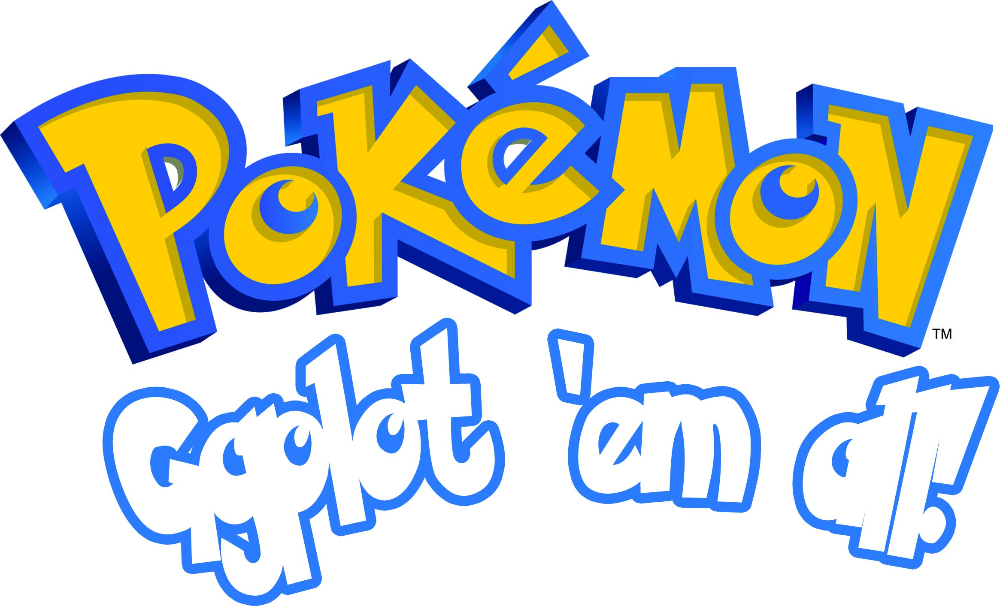
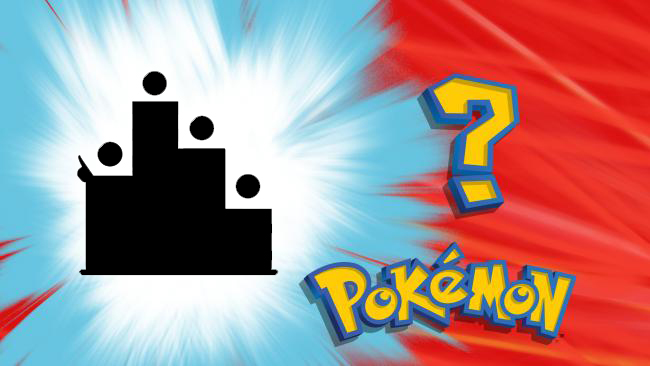
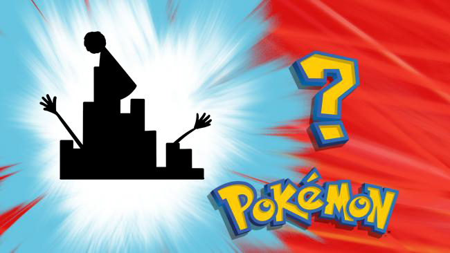
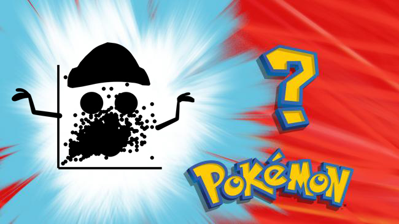

```{r setup, include = FALSE}
knitr::opts_chunk$set(comment = "#", warning = FALSE, message = FALSE)
if (!require(remotes)) install.packages("remotes"); library(remotes)
if (!require(fontawesome)) install_github("rstudio/fontawesome"); library(fontawesome)
if(!require(tidyverse)) install.packages("tidyverse"); library(tidyverse)
if(!require(ggrepel)) install.packages("ggrepel"); library(ggrepel)
if (!require(viridis)){install.packages("viridis")}; library(viridis)
if(!require(gghighlight)) install.packages("gghighlight"); library(gghighlight)
```

layout: true
  
<!-- <div class="my-footer"><span>arm.rbind.io/slides/xaringan</span></div> -->

<!-- this adds the link footer to all slides, depends on my-footer class in css-->

---

name: xaringan-title
class: left, middle
background-image: url(img/background.jpg)
background-size: cover

# 



### .fancy[R Data Visualization Workshop]

.large[Winson Yang | Texas Tech University | `r Sys.Date()`]

<!-- this ends up being the title slide since seal = FALSE-->

---


# Acknowledgements

.pull-left[

.pull-left[


[TTU Department of Psychological Sciences](https://www.depts.ttu.edu/psy/)


]

.pull-right[


[Dr Robert Morgan, Department Chair](https://www.depts.ttu.edu/psy/people/rmorgan/index.php)

]

]

.pull-right[

.pull-left[


[Sean O'Bryan, Psychological Sciences Graduate Student Advisory Council](https://www.depts.ttu.edu/psy/caprockscience/people.php)

]

.pull-right[


[Joshua Brown, Psychological Sciences Graduate Student Advisory Council](https://www.depts.ttu.edu/psy/sith/people.php)

]


]


[Artwork by Dr Allison Horst @allison_horst](https://twitter.com/allison_horst)


---

class: right, middle


# Find me at...

[`r fa(name = "twitter")` @winsonfzyang](http://twitter.com/winsonfzyang)  
[`r fa(name = "github")` @winsonfzyang](http://github.com/winsonfzyang)  
[`r fa(name = "link")` winsonfzyang.github.io](https://winsonfzyang.rbind.io)  
[`r fa(name = "paper-plane")` winson.yang@ttu.edu](mailto:winson.yang@ttu.edu)

---

# Who am I 

--

Third year Experimental (Cognitive) Psychology student.

- Projects include Neuromodulation (neurofeedback, brain stimulation), Neuroscience of Meditation, Mental flexibility, Neurodegeneration, Cancer caregiving

--

Other projects

- data visualization, UX/UI, software development for neuroscientists and psychologists  
- Environmental sustainability for the neuroimaging community
- Mentoring and Programming Education


---

background-image: url(img/welcome_to_rstats_twitter.png)
background-position: center
background-size: contain
class: center, bottom

---

# Workshop aims
learn how to use the `ggplot` package from the `tidyverse` collection:
- data visualization and `ggplot2` grammar
- creating different types of plots
- customizing plots
- emphasizing your data


It is okay if you do not understand R at all. We have line-by-line examples and code for you to follow through


---

class: inverse, middle, center

# Day I: Basic Data Visualization

---

background-image: url(img/ggplot2_exploratory.png)
background-position: center
background-size: contain
class: center, bottom


---


# Why ggplot

* Automatic legends, colors, etc.

* Easy superposition, facetting, etc.

* Nice rendering (yet, I don't like the default grey theme).

* Store any ggplot2 object for modification or future recall. Super useful for packages.

* Lots of users (less bugs, much help on Stack Overflow).

* Lots of extensions.

* Nice saving option.

---

# Grammar of ggplot

<center>

</center>

---


# Three wild plots we will cover today!

.pull-left[

<center>

</center>

]

.pull-right[

.pull-top[

<center>

</center>

]

.pull-bottom[

<center>

</center>

]


]


---

class: center, middle

# Sample plot we will create over the two days


```{r message = FALSE, echo = FALSE}
# Load data
df <- read_csv("./../data/pokemon.csv")

poke_colors <- c(`Normal` = "#A8A77A", `Fire` = "#EE8130", `Water` = "#6390F0",
                `Electric` = "#F7D02C", `Grass` = "#7AC74C", `Ice` = "#96D9D6",
                 `Fighting` = "#C22E28", `Poison` = "#A33EA1", `Ground` = "#E2BF65",
                 `Flying` = "#A98FF3", `Psychic` = "#F95587", `Bug` = "#A6B91A",
                 `Rock` = "#B6A136", `Ghost` = "#735797", `Dragon` = "#6F35FC",
                 `Dark` = "#705746", `Steel` = "#B7B7CE", `Fairy` = "#D685AD")

df %>% 
  filter(generation==1) %>%
  select(weight_kg, height_m, speed) %>% 
  filter(!is.na(weight_kg)) %>% 
  ggplot(aes(x=weight_kg, y=height_m)) +
  geom_smooth(method="glm", se=FALSE, color="black") +
  geom_point(aes(fill=speed), size=4, pch=21, color="black") +
  gghighlight(n=1, (weight_kg > 200 & height_m >6) | 
                (weight_kg >250 & height_m < 3) |
                (weight_kg <100 & height_m > 2.5)) +
  labs(x="Weight (kg)", y= "Height (m)", fill = "Speed") +
  geom_label_repel(data=subset(df %>% filter(generation==1), 
                               (weight_kg > 200 & height_m >6) | 
                                 (weight_kg >250 & height_m < 3) |
                                 (weight_kg <100 & height_m > 2.5)), 
                   aes(label=name), 
                   box.padding = 0.35, 
                   point.padding = 0.5, 
                   segment.color = 'grey50') +
  scale_fill_viridis() +
  theme_minimal() 
```

---


class: center, middle

# Thanks! 

# Now let's get hands-on!

Slides created via the R package [**xaringan**](https://github.com/yihui/xaringan).
